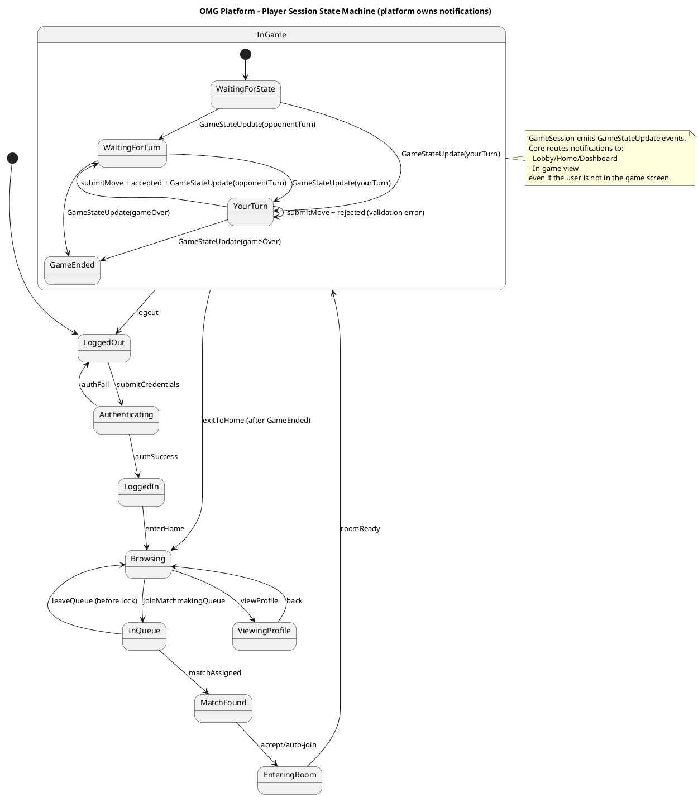

# Platform State Machine #

This setup meets the following conditions:

- Game code never directly pings the lobby UI
- Game code emits a GameStateUpdate (or domain event)
- The Core Platform consumes it and decides:
    i. If player is in lobby, notify the player
    ii. If player is in game view, update the board and enable input

For use in [editor.plantuml.com](editor.plantuml.com), png attached:

