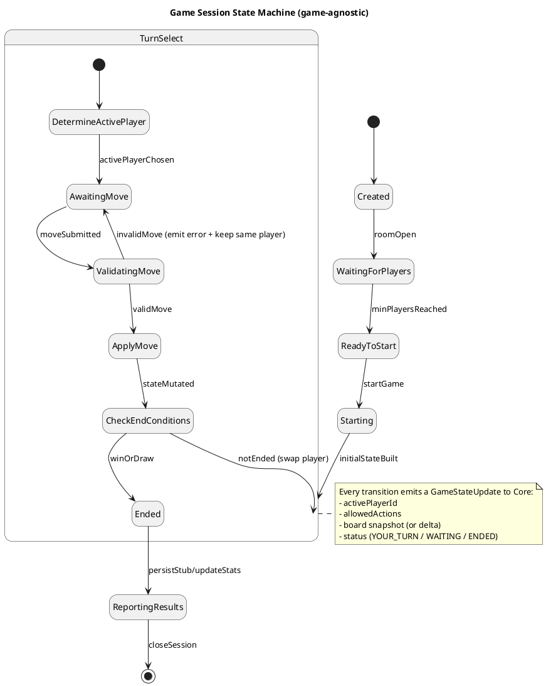

# Game State Machine #

The following code can be used in [editor.plantuml.com](editor.plantuml.com)

```plantuml
@startuml
title Game Session State Machine (game-agnostic)
hide empty description

[*] --> Created
Created --> WaitingForPlayers : roomOpen
WaitingForPlayers --> ReadyToStart : minPlayersReached
ReadyToStart --> Starting : startGame

Starting --> TurnSelect : initialStateBuilt

state TurnSelect {
  [*] --> DetermineActivePlayer
  DetermineActivePlayer --> AwaitingMove : activePlayerChosen
  AwaitingMove --> ValidatingMove : moveSubmitted
  ValidatingMove --> AwaitingMove : invalidMove (emit error + keep same player)
  ValidatingMove --> ApplyMove : validMove
  ApplyMove --> CheckEndConditions : stateMutated
  CheckEndConditions --> TurnSelect : notEnded (swap player)
  CheckEndConditions --> Ended : winOrDraw
}

Ended --> ReportingResults : persistStub/updateStats
ReportingResults --> [*] : closeSession

note right of TurnSelect
Every transition emits a GameStateUpdate to Core:
- activePlayerId
- allowedActions
- board snapshot (or delta)
- status (YOUR_TURN / WAITING / ENDED)
end note

@enduml
```